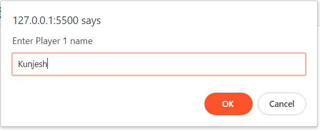
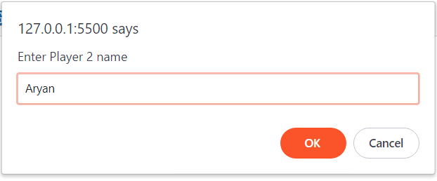
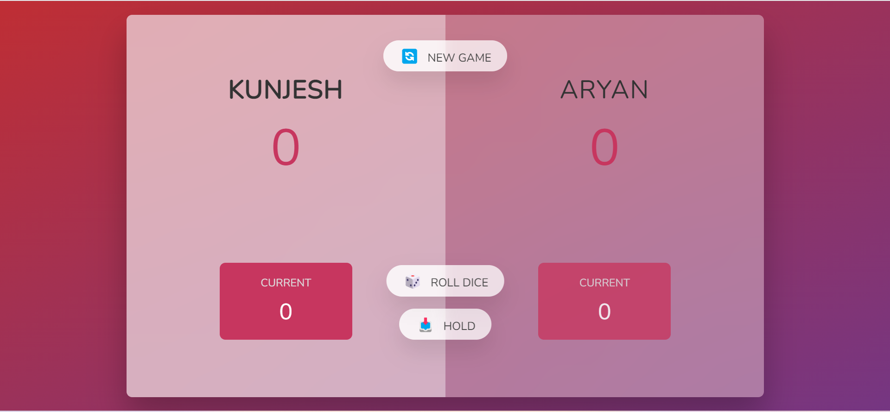
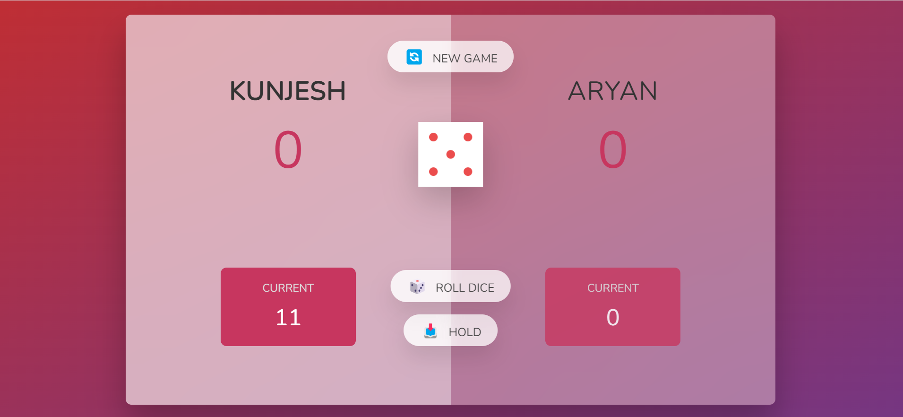
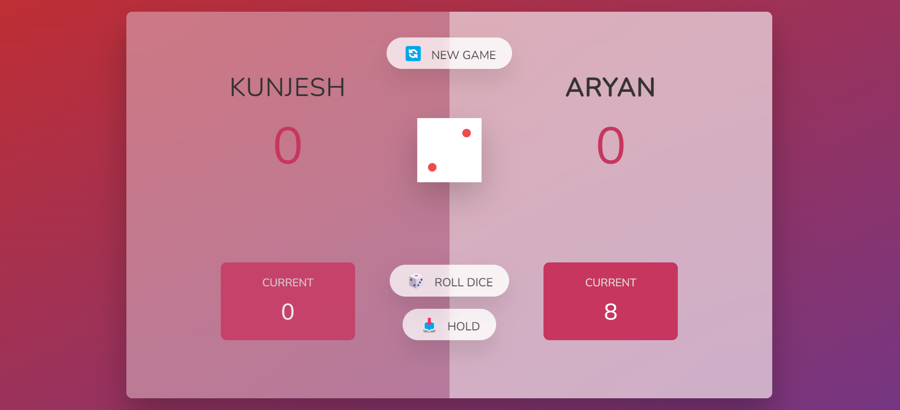
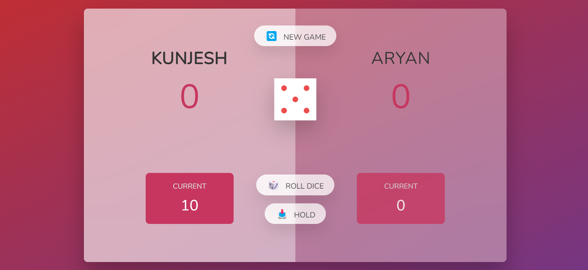
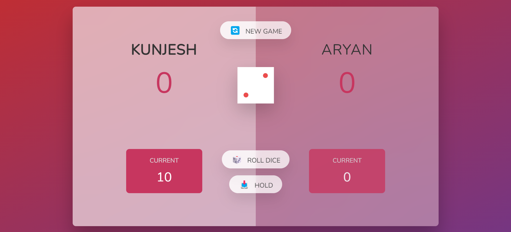
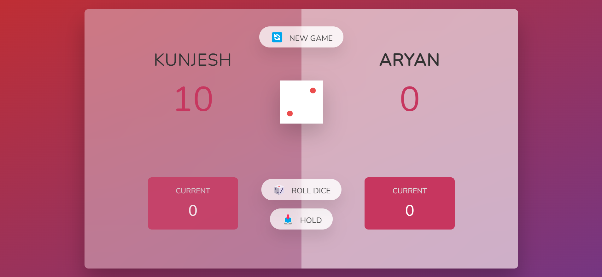
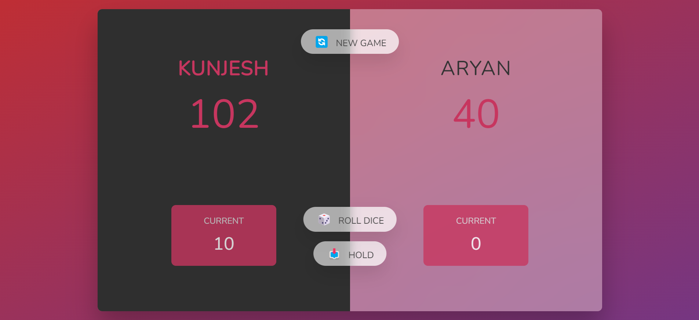
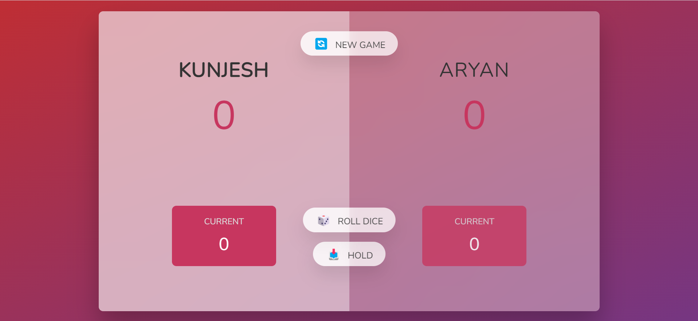

# **Roll the Dice**

## **Introduction**

* ### This game can be played between 2 players. Two prompt windows will be appeared for the player's name

* ### Now, the active player have to roll a dice

* ### After rolling a dice, the active player can either hold the current points or continue to roll dice

* ### If the next number on dice is 1 then all the current point will be reset to 0, and the opponent player will continue to play

* ### Whosever reaches 100 points, will win the game

You can clone & run this game in your PC.

## **Programming Language and Technologies used**

* [x] HTML, CSS & JS

* [x] Visual Studio Code

* [x] Git

## **Concepts Used**

> 1. Basic HTML & CSS
>
> 2. querySelector
>
> 3. getElementById
>
> 4. addEventListener
>
> 5. classList

## **Resources**

1. Online Lectures
2. Google

## **Screenshots**

<h2><b>1. Asking for player's names</b></h2>

---
---

<h2><b>2. Initial screen </b></h2>

---
---

<h2><b>3. Rolling for Player 1 (Clicking 'ROLL DICE')</b></h2>

---
---

<h2><b>4. Rolling for Player 2 (Clicking 'ROLL DICE)</b></h2>

---
---

<h2><b>5. When 1 occurs in dice (Current score set to 0)</b></h2>

---
---

<h2><b>6. Holding the number(Clicking 'HOLD')</b></h2>

---
---

<h2><b>7. Win</b></h2>

 

---
---

<h2><b>8. Reset (Clicking 'NEW GAME')</b></h2>

 

  
  
  

# 
**A Big Thank You!**

